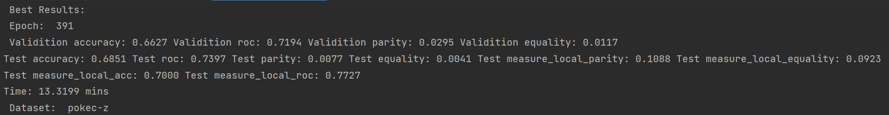
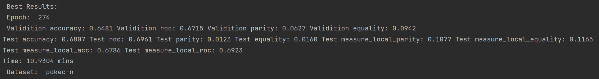

# F2GNN

Code for ICDM 2023 paper: "*Equipping Federated Graph Neural Networks with Structure-aware Group Fairness*".

Nan Cui, Xiuling Wang, [Wendy Hui Wang](https://sites.google.com/view/wendy-wang/home), Violet Chen, [Yue Ning](https://yue-ning.github.io/)


## Requirements

The code has been successfully tested in the following environment. (For older versions, you may need to modify the code.)

- python==3.9
- dgl_cuda11.6==0.9.1
- networkx==2.8.8
- numpy==1.23.5
- pandas==1.5.2
- scikit_learn==1.2.0
- scipy==1.10.0
- torch==1.13.1+cu116
- torch_geometric==2.2.0
- tqdm==4.64.1

## Installations

```bash
pip install -r requirements.txt
```

## Usage

For the Pokec-z dataset:

```bash
python main.py --alpha=1e-06 --dataset='pokec-z' --dropout=0.5 --ego_number=30 --gpu=0 --lambda1=0.5 --local_ep=20 --lr=0.0001 --num_hidden=64 --num_hops=3 --seed=31 --tau=4 --tau_combine=0.01 --weight_decay=0.001
```

For the Pokec-n dataset:

``````bash
python main.py  --alpha=1e-06 --dataset='pokec-n' --dropout=0.1 --ego_number=30 --gpu=0 --lambda1=8.0 --local_ep=15 --lr=0.0001 --num_hidden=64 --num_hops=3 --seed=47 --tau=4 --tau_combine=0.001 --weight_decay=0.0001
``````

## Results

For the pokec-z dataset:



For the pokec-n dataset:



## Cite

Please cite our paper if you find this code useful for your research:

```
N. Cui, X. Wang, W. H. Wang, V. Chen and Y. Ning, "Equipping Federated Graph Neural Networks with Structure-aware Group Fairness," 2023 IEEE International Conference on Data Mining (ICDM), Shanghai, China, 2023.
```

**BibTeX**

```latex
@INPROCEEDINGS{10415822,
  author={Cui, Nan and Wang, Xiuling and Wang, Wendy Hui and Chen, Violet and Ning, Yue},
  booktitle={2023 IEEE International Conference on Data Mining (ICDM)}, 
  title={Equipping Federated Graph Neural Networks with Structure-aware Group Fairness}, 
  year={2023},
  volume={},
  number={},
  pages={980-985},
  keywords={Training;Analytical models;Privacy;Training data;Data models;Graph neural networks;Security;Graph Neural Networks;Federated Learning;Group Fairness},
  doi={10.1109/ICDM58522.2023.00111}}
```
